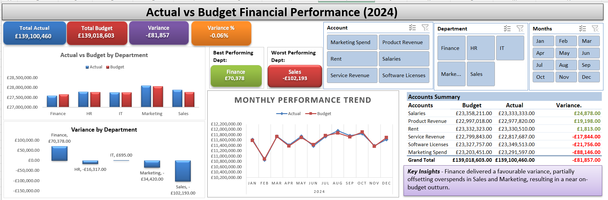

# Project 1

**Title:** [Excel Financial Dashboard – Actual vs Budget Analysis (2024)](https://github.com/Sheyi04/Sheyi04.github.io/blob/main/Excel%20Financial%20Dashboard%20%E2%80%93%20Actual%20vs%20Budget%20Analysis%20(2024).xlsx)

**Tools Used:** Microsoft Excel (PivotTable, PivotCharts, Slicers, Dynamic Array Functions (VSTACK, UNIQUE), Conditional Formatting, Data Cleaning & Transformation)

**Project Description:** This project showcases an interactive Excel financial dashboard designed to analyse actual vs budget performance for the 2024 period. The dashboard provides a clear, executive-level view of financial results, including total actuals, budgets, variances, and variance percentages. Users can explore performance by department, account, and month using slicers, enabling both high-level insights and detailed variance analysis. The solution is built entirely in Microsoft Excel, without relying on external BI tools.

The dashboard includes the following analyses:

_Overall actual vs budget performance with variance and variance percentage_

_Actual vs budget comparison by department_

_Variance analysis by department to identify over- and under-performance_

_Monthly actual vs budget trend analysis_

_Best and worst performing departments based on variance_

_Account-level variance breakdown_

_Key insights highlighting the main drivers of financial performance_

**Key findings:** 
1. Overall financial performance for 2024 was close to budget, with a small unfavourable variance of £81,857 (-0.06%), indicating effective budget control at an aggregate level.

2. Finance was the best-performing department, delivering a favourable variance that helped offset overspends in other areas.

3. Sales recorded the largest unfavourable variance, making it the primary driver of overall budget underperformance.

4. Marketing also exceeded budget, contributing to the negative variance despite strong performance in other departments.

5. At an account level, Product Revenue and Salaries performed favourably against budget, while Marketing Spend and Software Licences showed notable overspends.

6. Monthly trend analysis shows fluctuations throughout the year, with certain months outperforming budget and others falling below expectations, highlighting the importance of ongoing monitoring rather than relying solely on year-end results.

**Business Recommendations:**
1. Strengthen cost controls in Sales and Marketing by reviewing campaign spend, commission structures, and discretionary expenses, as these areas were the primary drivers of the unfavourable variance.

2. Leverage Finance’s strong budget performance by identifying best practices in forecasting and expense management that can be applied across other departments.

3. Implement regular month-by-month variance reviews using the dashboard to detect emerging overspends early and take corrective action before year-end.

4. Investigate recurring account-level overspends, particularly in Marketing Spend and Software Licences, to determine whether budgets should be revised or controls tightened.

5. Use the dashboard as an ongoing management tool, not just a reporting output, to support informed decision-making, accountability, and improved financial discipline.

**Dashboard Overview:** 

# Project 2

**Title:** [Car Sales Performance](https://github.com/Sheyi04/Sheyi04.github.io/blob/main/Car%20Sales%20Perfomance%20(2016-2020).xlsx)

**Tool Used:** Microsoft Excel (PivotTable, PivotCharts, Slicers, Conditional Formatting, Timelines, Data Cleaning & Transformation)

**Project Description:** The Car Sales Performance: 2016-2020 provides an in-depth analysis of car sales across multiple manufacturers over a five-year period. It offers insights into sales by manufacturer, production year, engine size, fuel type, and individual model performance. This project is designed for automotive analysts, market researchers, and business stakeholders to identify trends, understand consumer preferences, and monitor market performance across different vehicle categories.

The dashboard includes the following analyses:

_Sales by Manufacturer_ – Total revenue generated by each car manufacturer.

_Sales Per Production Year_ – Trends in sales across model years.

_Engine Size Sales Value_ – Revenue distribution by engine displacement.

_Fuel Type Pricing Overview_ – Comparison of sales value across petrol, diesel, and hybrid vehicles.

_Sales Value by Model_ – Top-performing models by revenue contribution.

Additionally, the dashboard includes interactive slicers and timelines for:

_Year of Manufacture_: Focus on specific model years or ranges to analyze trends over time.

_Manufacturer_: Drill down into the performance of individual car brands.

_Model/Engine/Fuel Type_: Explore sales performance by specific models, engine sizes, or fuel types

**Key findings:** 
1. _Sales by Manufacturer_: Toyota leads with £180M, followed by Ford (£159.6M), VW (£154.5M), BMW (£121.3M), and Porsche (£75.9M).
Total sales across all manufacturers reached £691M.

2. _Sales Per Production Year_: Older models (1980s–1990s) had low sales, while recent models (2015–2020) drove most revenue.
Peak sales for most manufacturers occurred between 2015 and 2018.

3. _Engine Size Sales Value_: Most revenue came from medium-sized engines (1.4–3.0L), suggesting strong market preference for balanced performance.
Larger engines (4–5L) contributed significantly for premium brands like BMW and Porsche.

4. _Fuel Type Pricing Overview_: Petrol vehicles generated the highest revenue overall (£348.9M), followed by diesel (£174.4M) and hybrid (£168.1M).
Toyota’s revenue is dominated by hybrid sales (£149M), reflecting their market focus on hybrid vehicles. BMW and Porsche primarily sold petrol vehicles.

5. _Sales Value by Model_: Top-performing models:
Toyota RAV4 – £83.4M
BMW M5 – £65.7M
Ford Mondeo – £65.5M
VW Passat & Golf – £62.8M and £52.3M respectively
Toyota Prius – £58.4M

This dashboard serves as a vital tool for automotive stakeholders, offering clear, actionable insights that support data-driven decision-making and strategic planning.

**Dashboard Overview:** 
  

# Project 3

**Title:** SQL Query Report - Employee & Salary Database

**SQL Code:** [SQL Query Report - Employee & Salary Database.sql](https://github.com/Sheyi04/Sheyi04.github.io/blob/main/SQL%20Query%20Report%20-%20Employee%20%26%20Salary%20Database.sql)

**SQL Skills Used:** SELECT, WHERE, BETWEEN, LIKE, UNION

Aggregate functions: 

_MAX(), MIN(), AVG()_

_Filtering and conditional queries_

_Pattern matching using LIKE_

_Range-based data extraction_

_Unique value extraction_

_Calculated fields (Salary + Variable)_

_Table comparison using UNION_

**Project Description:** Workforce Data and Project Allocation Report is a simple SQL-based data analysis project created using two datasets: Employee Details and Employee Salary.
The project demonstrates the ability to query relational data to answer HR- and payroll-related business questions such as:

_Identifying employees under a given manager_

_Extracting unique project assignments_

_Calculating employee salary ranges and averages_

_Finding project-wise employee counts_

_Filtering employees based on location, manager, project type_

_Combining employee identifiers across tables_

_Computing derived salary fields (salary + variable)_

This project highlights foundational SQL query writing and the ability to convert business requirements into actionable database queries.

**Technology used:** SQL server, SSMS (SQL Server Management Studio)

# Project 4

**Title:** [Product Sales Performance Report](https://github.com/Sheyi04/Sheyi04.github.io/blob/main/Product%20Sales%20Performance%20Report.pbix)

**Tools Used:** Power BI Desktop (Column Chart, Bar Chart, Line Chart, Donut Chart, Table Visual, Card Visual, Slicer, Visual formatting & dashboard layout, Basic DAX Measures)

**Project Description:** This project presents a Power BI dashboard that analyzes product sales performance over a three-month period (September–November). The report focuses on identifying sales patterns across customers, sales reps, product titles, and product categories. Visual elements such as bar charts, column charts, line charts, tables, card visuals, and slicers were used to create a clear and interactive analytical experience.

The dashboard highlights:

_Monthly sales trends_

_Top 10 customers by sales volume_

_Performance of sales representatives_

_Best-selling product items and categories_

_Total sales units achieved_

_Key insights, including the impact of promotions on October sales_

This report demonstrates skills in data visualization, dashboard design, and insight generation using Power BI.

**Key findings:**

1. October recorded the highest sales, driven primarily by promotional activity on Puregro Rice products.

2. Puregro Rice was the top-performing product category, contributing the largest share of total sales volume (over one-third of overall units).

3. Viva Mart Limited was the top customer, generating the highest number of sales units among all buyer accounts.

4. Sales Rep 2 outperformed all other sales reps, achieving the highest sales volume during the period.

5. Top items such as Puregro Golden Sella Basmati Rice consistently dominated sales, indicating strong customer demand for rice products.

6. Sales in November slightly declined compared to October, suggesting the promotional boost did not continue into the following month.

   **Dashboard Overview:**

